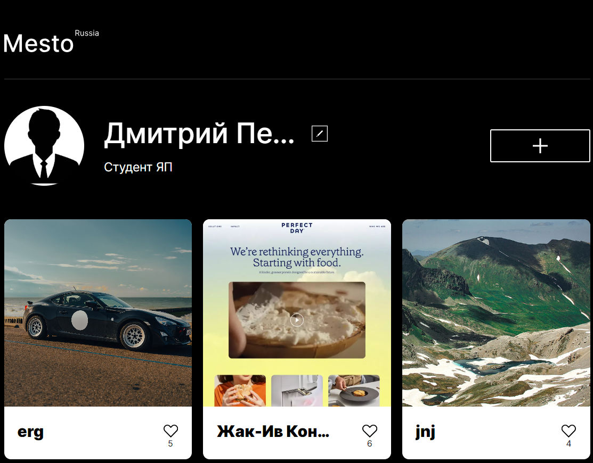

# Проект: Место от _"Yandex Practicum"_.

Проект "Mesto" - это простое веб-приложение, которое представляет собой страницу для обмена фотографиями и путешествиями. Пользователи могут просматривать фотографии различных мест, добавлять свои собственные фотографии, ставить лайки и редактировать свой профиль. [Ссылка на gh-pages](https://dmitry145528.github.io/mesto/) | [Ссылка на макет в Figma](https://www.figma.com/file/oV518UvkIxSPcm7jH3FDnI/JavaScript.-Sprint-9?type=design&node-id=0-1&mode=design&t=TV2nRwYVOqtVrDvX-0)



## Структура проекта:

* Mesto (версия Java Script) - этот репозиторий
* [Mesto (версия React)](https://github.com/Dmitry145528/react-mesto-auth)
* [Mesto (версия для сервера)](https://github.com/Dmitry145528/express-mesto-gha)
* [Mesto (версия с фронтендом и бэкендом)](https://github.com/Dmitry145528/react-mesto-api-full-gha)

## Что сделал: 

* Создал компоненты интерфейса, такие как карточки с фотографиями, формы для ввода данных, профиль пользователя и другие. Применил Flexbox и Grid Layout для создания структуры страницы.

* Я реализовал запросы к API, включая GET и POST запросы, а также другие необходимые для взаимодействия с сервером. Эти запросы позволили получать данные о фотографиях, загружать новые фотографии на сервер, а также обновлять информацию о профиле пользователя.

* Написал компонент для валидации данных, вводимых пользователями в различные формы. Это помогает предотвратить отправку некорректной или неполной информации на сервер.

* Применил JavaScript и CSS для добавления анимаций и эффектов при взаимодействии пользователя с интерфейсом, что делает его более интерактивным и привлекательным.

* Внедрил функциональность для сохранения некоторых данных на стороне клиента, что повышает производительность и удобство использования приложения.

## Реализованный функционал:

* Пользователи могут просматривать фотографии мест, загруженные другими пользователями.

* Пользователи могут выражать своё восхищение фотографиями, ставя лайки.

* Пользователи могут добавлять новые места, создавая собственные карточки, которые будут доступны для просмотра другим участникам. Также имеется возможность удалить собственную карточку, если она перестала быть актуальной.

* Пользователи могут просматривать фотографии в увеличенном режиме, открывая их в модальном окне.

* Каждый пользователь имеет возможность изменить свои данные, такие как имя, аватар и деятельность.

## Технолгии:

* Технология ___Flex-вёрстка___.
* Технология ___@font-face___.
* Технология для сложных сеток ___Grid-Layout___.
* Технология гибких элементов и блоков, при помощи относительных единиц ___vw/vh/%/rem/em___.
* Технология псевдокласса ___:hover___.
* Технология заплнения и отправки формы при помощи JavaScript.
* Технология позиционирования элементов.
* Технология ___БЭМ (Nested)___.
* Технология адптации вёрстки под разные устройства __@media screen__.
* Технология работы с тегом template.
* Технология работы с методами массива.
* Технология работы с данными по умолчанию.
* Технология по валидации форм.
* Технология написания ООП.
* Технология ___import___ и ___export___.
* Технология работы модулей.

## Инструкция по запуску:

1. **Склонировать репозиторий:**
   ```sh
   git clone git@github.com:Dmitry145528/mesto.git
   git clone https://github.com/Dmitry145528/mesto.git

2. **Перейдите в директорию проекта, выполнив команду:**

   cd mesto

3. **Установите все необходимые зависимости проекта, выполнив команду:**

   npm install

4. **Перед запуском проекта в режиме разработки или деплоем на хостинг, необходимо собрать проект. Для этого выполните команду:**

    npm run build

5.  **Вы можете запустить проект в режиме разработки, выполнив команду:**

    npm run dev

6. **Если вы хотите разместить ваш проект на GitHub Pages, выполните следующую команду:**

    npm run deploy

## Статус разработки:

✅ _Завершено_

Дальнейшая разработка ведётся в репозитории [Mesto (версия на React)](https://github.com/Dmitry145528/react-mesto-auth)